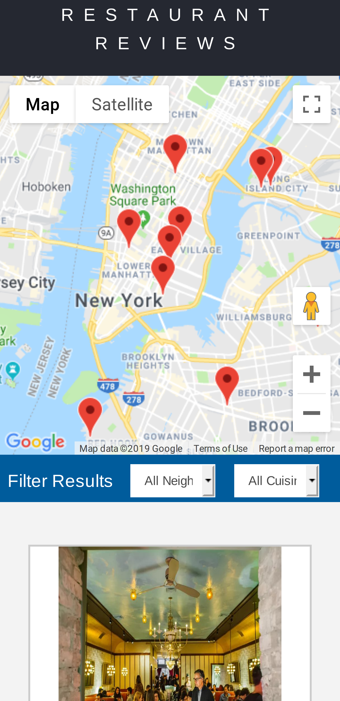
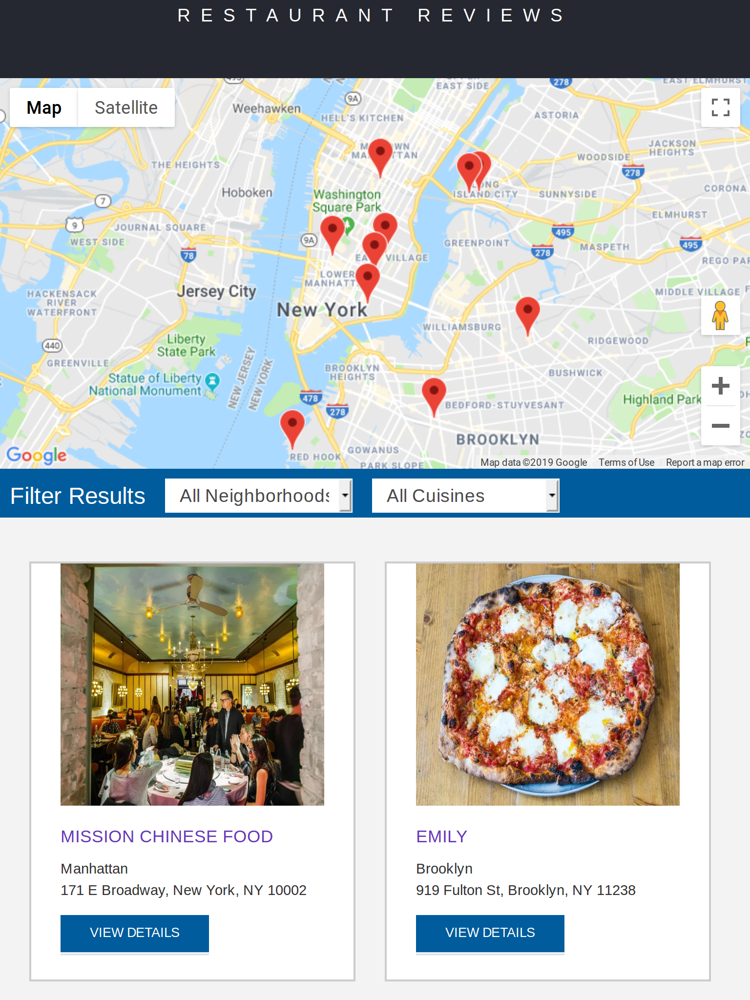
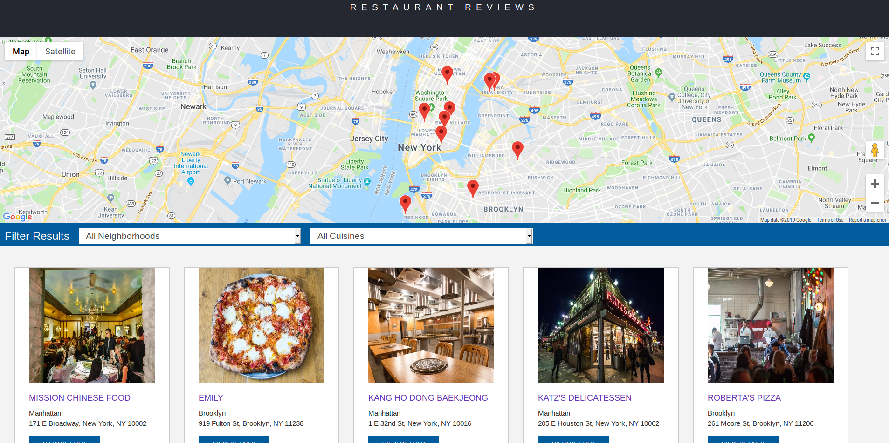

# Restaurant Reviewers project 

- [Project Overview](#Project_Overviwe)
- [Getting Start](#Getting_start)
- [How website work](#How's_working)
- [Screen shot](#Screenshot)
- [Features](#Features)
- [Prerequesties](#Prerequisite)

## Project_Overview 
 Show navigation and reviwes  about some restaurants 🍕 🍍 🍟 

## Screenshot 📸

## Getting_start 
 Download repo from [here](https://github.com/abdulrahmanabdullah/restaurant_reviews.git) then run index.html that's it 🤓 

## How's_working
 fetch data from json file **restaurants.json** then fill DOM with this data, very simple, right? 😆  

## Features 
- Pure HTML,Css,Javascript 
- Using Promsies in Javascript
- Responsive web page 
- Using [Accessibility structure](https://www.w3.org/WAI/tutorials/page-structure/headings/) .
- Caching files 
- Offline mode with [Service worker](https://developers.google.com/web/ilt/pwa/introduction-to-service-worker)

## Prerequisite 
 *you not need downloading any third party or library all this pages built with HTML,CSS and JavaScript*
